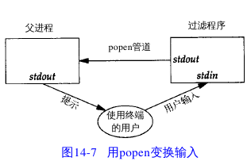
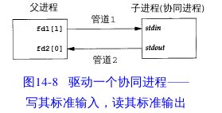

# Advanced Programming in the UNIX Environment

## I/O

### 不用缓存的I/O

函数open,read,write,lseek,close提供了不用缓存的I/O
这些函数都用文件描述符进行工作

```c
#include "apue.h"

#define BUFFSIZE 8192

int main(int argc, char *argv[])
{
	int n;
	char buf[BUFFSIZE];

	while ( (n = read(STDIN_FILENO, buf, BUFFSIZE)) > 0 )
		if ( (write(STDOUT_FILENO, buf, n)) != n )
			err_sys("wrirte error");

	if (n < 0)
		err_sys("read error");

	exit(0);
}
```

## IPC

### 例子1

创建一个从父进程到子进程的管道,并且父进程向子进程传递数据

```c
#include "apue.h"

const char *msg1 = "This is parent speaking\n";

int main(int argc, char *argv[])
{
	int rbyte;
	int fd[2];
	pid_t pid;
	char line[MAXLINE];

	if (pipe(fd) < 0)
		err_sys("pipe error");

	if ((pid = fork()) < 0)
	{
		err_sys("fork error");
	}
	else if (pid > 0) /* parent */
	{
		close(fd[0]);
		write(fd[1], msg1, strlen(msg1));
	}
	else /* child */
	{
		close(fd[1]);
		rbyte = read(fd[0], line, MAXLINE);
		write(STDOUT_FILENO, line, rbyte);
	}

	exit(0);
}
```

### 例子2

下面程序每次显示一页数据,由于more具有这个功能,所以可以将输出的数据传递给more

```c
#include <sys/wait.h>
#include "apue.h"

/* default pager program */
#define DEF_PAGER "/bin/more"

int main(int argc, char *argv[])
{
	int rbyte;
	int fd[2];
	pid_t pid;
	char *pager;
	char *argv0;
	char line[MAXLINE];
	FILE *fp;

	if (argc != 2)
		err_quit("Usage: %s <filename>", argv[0]);

	if ((fp = fopen(argv[1], "r")) == NULL)
		err_sys("can't open %s", argv[1]);

	if (pipe(fd) < 0)
		err_sys("pipe error");

	if ((pid = fork()) < 0)
	{
		err_sys("fork error");
	}
	else if (pid > 0) /* parent */
	{
		close(fd[0]);

		while (fgets(line, MAXLINE, fp) != NULL)
		{
			rbyte = strlen(line);
			if (write(fd[1], line, rbyte) != rbyte)
				err_sys("write to pipe error");
		}
		if (ferror(fp))
			err_sys("fgets error");

		close(fd[1]);

		if (waitpid(pid, NULL, 0) < 0)
			err_sys("waitpid error");

		exit(0);
	}
	else /* child */
	{
		close(fd[1]);

		/* dup fd0 to stdin */
		if (fd[0] != STDIN_FILENO)
		{
			if (dup2(fd[0], STDIN_FILENO) != STDIN_FILENO)
			{
				err_sys("dup2 error");
			}
			close(fd[0]);
		}

		/* get argument for execl */
		if ((pager = getenv("PAGER")) == NULL)
			pager = DEF_PAGER;

		if ((argv0 = strrchr(pager, '/')) != NULL)
			argv0++;
		else
			argv0 = pager;

		if (execl(pager, argv0, (char *)0) < 0)
			err_sys("execl error for %s", pager);
	}

	exit(0);
}
```

### 例子3

函数popen先执行fork,然后调用exec执行cmdstring
并且返回一个标准I/O文件指针
如果type是"r",则文件指针连接到cmdstring的标准输出
如果type是"w",则文件指针连接到cmdstring的标准输入


```c
#include <sys/wait.h>
#include "apue.h"

/* environment variable or default(more) */
#define PAGER "${PAGER:-more}"

int main(int argc, char *argv[])
{
	char line[MAXLINE];
	FILE *fpin, *fpout;

	if (argc != 2)
		err_quit("Usage : %s <filename>", argv[0]);

	if ((fpin = fopen(argv[1], "r")) < 0)
		err_sys("can't open %s", argv[1]);

	if ((fpout = popen(PAGER, "w")) == NULL)
		err_sys("popen error");

	/* copy argv[1] to pager */
	while (fgets(line, MAXLINE, fpin) != NULL)
	{
		if (fputs(line, fpout) == EOF)
			err_sys("fputs to pipe error");
	}

	if (ferror(fpin))
		err_sys("fgets error");

	if (pclose(fpout) == -1)
		err_sys("pclose error");

	exit(0);
}
```

### 例子4

下面程序,向标准输出写一个提示
然后从标准输入读入1行,使用popen可以在应用程序
和输入之间插入一个程序以对输入进行处理,
下面代码的处理程序是将大写字母转换为小写



```c
#include <sys/wait.h>
#include "apue.h"

int main(int argc, char *argv[])
{
	char line[MAXLINE];
	FILE *fpin;

	if ( (fpin = popen("./myuclc", "r")) == NULL )
		err_sys("popen error");

	for (;;)
	{
		fputs("prompt> ", stdout);
		fflush(stdout);

		/* read from pipe */
		if (fgets(line, MAXLINE, fpin) == NULL)
			break;

		if (fputs(line, stdout) == EOF)
			err_sys("fputs error to pipe");
	}

	if (pclose(fpin) == -1)
		err_sys("pclose error");

	putchar('\n');
	exit(0);
}
```
### 例子5(两个半双工版本)

当同一个程序产生某个过滤程序的输入,
同时又读取该过滤程序的输出时,
则该过滤程序就是协同程序(coprocess)



进程先创建两个管道,
一个是协同进程的标准输入,
另一个是协同进程的标准输出

协同程序代码如下,
它从其标准输入读两个数,
计算它们的和,然后将结果写至其标准输出

```c
#include "apue.h"

int main(int argc, char *argv[])
{
	int bytes;
	int a, b;
	char line[MAXLINE];

	while ( (bytes = read(STDIN_FILENO, line, MAXLINE)) > 0)
	{
		/* null terminate */
		line[bytes] = 0;

		if (sscanf(line, "%d%d", &a, &b) == 2)
		{
			sprintf(line, "%d\n", a + b);
			bytes = strlen(line);

			write(STDOUT_FILENO, line, bytes);
		}
	}

	exit(0);
}
```

主程序从其标准输入读入两个数后调用协同程序,
从协同程序得到结果写道标准输出

```c
#include <signal.h>
#include "apue.h"

void sig_pipe(int signo)
{
	printf("SIGPIPE caught\n");
	exit(1);
}

int main(int argc, char *argv[])
{
	int n;
	int fd1[2]; /* for write */
	int fd2[2]; /* for read */
	pid_t pid;
	char line[MAXLINE];

	if (signal(SIGPIPE, sig_pipe) == SIG_ERR)
		err_sys("signal error");

	if (pipe(fd1) < 0 || pipe(fd2) < 0)
		err_sys("pipe error");

	if ( (pid = fork()) < 0 )
		err_sys("fork error");
	else if (pid > 0) /* parent */
	{
		close(fd1[0]);
		close(fd2[1]);

		/* parent read from stdin */
		while (fgets(line, MAXLINE, stdin) != NULL)
		{
			n = strlen(line);

			/* write to coprocess */
			if (write(fd1[1], line, n) != n)
				err_sys("write to pipe error");

			/* read result from coprocess */
			if ( (n = read(fd2[0], line, MAXLINE)) < 0 )
				err_sys("read from pipe error");

			if (0 == n)
			{
				err_msg("coprocess closed pipe");
				break;
			}

			/* null terminate */
			line[n] = 0;

			if (fputs(line, stdout) == EOF)
				err_sys("fputs error");
		}
		if (ferror(stdin))
			err_sys("fgets error on stdin");
		exit(0);
	}
	else /* coprocess */
	{
		close(fd1[1]);
		close(fd2[0]);

		/* redirection pipe to stdin and stdout */
		if (fd1[0] != STDIN_FILENO)
		{
			if (dup2(fd1[0], STDIN_FILENO) != STDIN_FILENO)
				err_sys("dup2 error to stdin");
			close(fd1[0]);
		}

		if (fd2[1] != STDOUT_FILENO)
		{
			if (dup2(fd2[1], STDOUT_FILENO) != STDOUT_FILENO)
				err_sys("dup2 error to stdout");
			close(fd2[1]);
		}

		if (execl("./add2", "add2", (char *)0) < 0)
			err_sys("execl error");
	}

	exit(0);
}
```

如果测试SIG_PIPE

当程序正在等待输入是,若杀死add2协同程序,然后输入两个数,这时再对管道进行操作时,由于该管道无法读进程,于是调用信号处理程序

