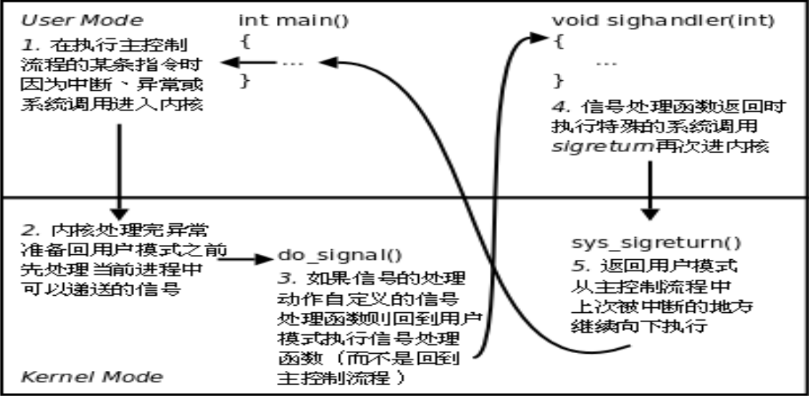
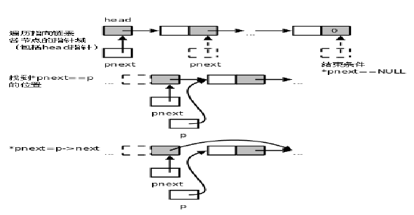

#内核如何实现信号的捕捉
如果信号的处理动作是用户自定义函数,在信号递达时就调用这个函数,这称为捕捉信号.  
由于信号处理函数的代码是在用户空间的,处理过程比较复杂,举例如下:  

1. 用户程序注册了 SIGQUIT 信号的处理函数 sighandler.  
2. 当前正在执行 main 函数,这时发生中断或异常切换到内核态.  
3. 在中断处理完毕后要返回用户态的 main 函数之前检查到有信号 SIGQUIT 递达.  
4. 内核决定返回用户态后不是恢复 main 函数的上下文继续执行,而是执行 sighandler 函数,sighandler 和 main 函数使用不同的堆栈空间,它们之间不存在调用和被调用的关系,是两个独立的控制流程。  
5. sighandler 函数返回后自动执行特殊的系统调用 sigreturn 再次进入内核态。  
6. 如果没有新的信号要递达,这次再返回用户态就是恢复 main 函数的上下文继续执行了。  

如下图所示:




#使用二级指针巧妙删除链表节点
```c
/*
 * delete 的优化版本
 * 不需要对是否是删除头部特殊判断
 * 这里巧用了二级指针操作
 * 一个指向当前节点的二级指针就是其上一节点
 */
void delete_plus(struct node *p)
{
	struct node **pnext;

	for (pnext = &head; *pnext; pnext = &(*pnext)->next)
	{
		if (*pnext == p)
		{
			*pnext = p->next;
			return;
		}
	}
}
```



#进程
+ 在各自独立的地址空间中运行
+ 共享数据需要mmap或者进程间通信机制

#线程
###需要在一个进程中同时执行多个控制流程就要用到线程
###进程里的信号处理函数也可以,只是线程更为灵活
###因为信号处理函数的控制流程只是在信号达到的时候产生
###在处理完信号后就结束,多线程的控制流程可以长期并存
###各线程之间共享的资源和环境:
+ 文件描述符表
+ 每种信号的处理方式(SIG_IGN、SIG_DFL 或者自定义的信号处理函数)
+ 当前工作目录
+ 用户 id 和组 id

##但有些资源是每个线程各有一份的:
+ 线程 id
+ 上下文,包括各种寄存器的值、程序计数器和栈指针
+ 栈空间
+ errno 变量
+ 信号屏蔽字
+ 调度优先级

#Mutex(线程间同步)
写程序时应该尽量避免同时获得多个锁,如果一定有必要这么做,则有一个原则:

###如果所有线程在需要多个锁时都按相同的先后顺序(常见的是按Mutex变量的地址顺序)获得锁, 则不会出现死锁。

比如一个程序中用到锁 1、锁 2、锁 3,它们所对应的Mutex 变量的地址
是 锁1< 锁2< 锁3,那么所有线程在需要同时获得 2 个或 3 个锁时都应该按锁1、锁2、锁 3的顺序获得。
如果要为所有的锁确定一个先后顺序比较困难,则应该尽量使用 pthread_mutex_trylock调用代替pthread_mutex_lock调用,以免死锁。

#信号量(Semaphore)
信号量(Semaphore)和Mutex类似,表示可用资源的数量,和Mutex不同的是这个数量可以大于1
本节介绍的是 POSIX semaphore 库函数,详见sem_overview(7)
这种信号量不仅可用于同一进程的线程间同步,也可用于不同进程间的同步.

#内存分配
C标准库里的3个分配函数
malloc 不负责把分配的内存空间清零
calloc 会负责把分配的内存空间用字节0填充
realloc 调整已分配的内存大小

POSIX标准中定义的分配函数
alloca
不是在堆上分配空间,而是在调用者函数的
栈帧上分配空间,类似于 C99 的变长数组,当调用者函数返回时自动释放栈帧
所以不需要free
这个函数不属于 C 标准库,而是在 POSIX 标准中定义的。

#段错误的产生流程
1. 用户程序要访问的一个虚拟地址,经MMU检查无权访问.
2. MMU 产生一个异常,CPU 从用户模式切换到特权模式,跳转到内核代码中执行异常服务程序.
3. 内核把这个异常解释为段错误,把引发异常的进程终止掉.

#SRAM and DRAM
SRAM static RAM(CPU的Cache通常由SRAM组成)
DRAM dynamic RAM(内存通常由DRAM组成)
DRAM电路比SRAM简单,存储容量可以做得更大,但DRAM的访问速度比SRAM慢.
